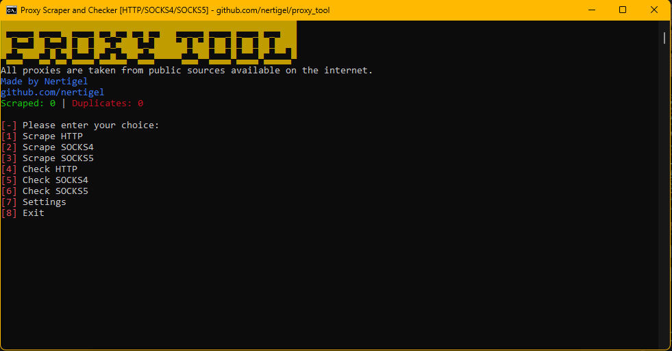

# proxy_tool - Use at your own risk
Python proxy scraper & checker. Gathers lists from various sites with an option to limit and shuffle output.
There are multiple settings to play with.

There might be better versions out there, but this is my try at it. Use it if you'd like!

## Features:
### Main menu:
1. Scrape HTTP
2. Scrape SOCKS4
3. Scrape SOCKS5
4. Check HTTP
5. Check SOCKS4
6. Check SOCKS5
7. Settings
8. Exit
### Settings menu:
0. Enable logging
1. Remove duplicate ips
2. Shuffle list output
3. Clear previous results from files
4. Limit proxies
5. Get response from
6. Timeout
7. Back

### scrape result, no duplicates(10/06/2023):
* http: 67446
* socks4: 38170
* socks5: 43963

###### moved from https://github.com/nertigel/py/blob/main/proxy_scrapper.py
